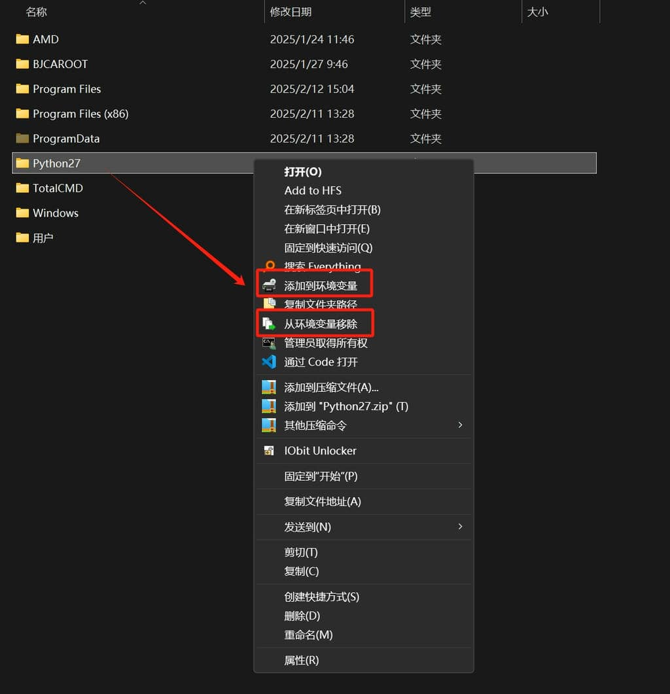

# Windows Path Manager / Windows 环境变量管理工具

[English](#english) | [中文](#chinese)

## English

### Introduction
Windows Path Manager is a convenient tool for managing system environment variables through the Windows context menu (right-click menu). It allows you to easily add or remove directories from the system PATH environment variable.

### Features
- Add directories to system PATH through right-click menu
- Remove directories from system PATH through right-click menu
- Clean up duplicate entries in system PATH
- User-friendly interface with both GUI and command-line options
- Administrator privileges check for system modifications

### Installation
1. Download the latest release
2. Run the program as administrator
3. Select "1" to install or use command `path_manager.exe install`

### Usage
After installation, you can:
- Right-click on any folder to add it to system PATH
- Right-click on any folder to remove it from system PATH
- Run the program directly to access the following options:
  - Install the context menu
  - Uninstall the context menu
  - Clean up duplicate PATH entries
  
### Command Line Options
path_manager.exe install   - Install the program
path_manager.exe uninstall - Uninstall the program
path_manager.exe cleanup   - Clean up duplicate PATH entries
path_manager.exe add <path>   - Add specified path to PATH
path_manager.exe remove <path> - Remove specified path from PATH

## Chinese

### 简介
Windows 环境变量管理工具是一个通过 Windows 右键菜单便捷管理系统环境变量的工具。它让您能够轻松地添加或删除系统 PATH 环境变量中的目录。

### 功能特点
- 通过右键菜单将目录添加到系统 PATH
- 通过右键菜单从系统 PATH 中移除目录
- 清理系统 PATH 中的重复条目
- 同时支持图形界面和命令行操作
- 系统修改时进行管理员权限检查

### 安装方法
1. 下载最新版本
2. 以管理员身份运行程序
3. 选择"1"进行安装或使用命令 `path_manager.exe install`

### 使用方法
安装后，您可以：
- 右键点击任何文件夹将其添加到系统 PATH
- 右键点击任何文件夹将其从系统 PATH 中移除
- 直接运行程序访问以下选项：
  - 安装右键菜单
  - 卸载右键菜单
  - 清理重复的 PATH 条目

### 命令行选项
path_manager.exe install   - 安装程序
path_manager.exe uninstall - 卸载程序
path_manager.exe cleanup   - 清理重复的环境变量
path_manager.exe add <path>   - 添加指定路径到环境变量
path_manager.exe remove <path> - 从环境变量移除指定路径

### 注意事项
- 修改系统环境变量需要管理员权限
- 建议在修改环境变量前备份当前设置
- 程序会自动去除重复的路径条目
